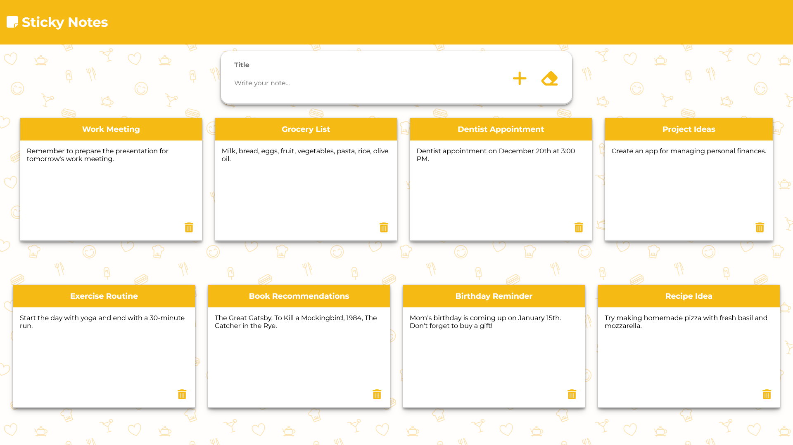

# Sticky Notes

## Descrizione
Sticky Notes è una web app che permette all'utente di inserire delle note, che vengono poi visualizzate a schermo. Ogni nota è composta da un titolo e da un contenuto.

## Funzionalità
- Inserimento di una nuova nota con un titolo e un contenuto.
- Visualizzazione a schermo di tutte le note inserite.
- Cancellazione delle note precedentemente inserite.

## Tecnologie Utilizzate
- React
- Node.js
- SCSS

## Installazione e Avvio Locale
1. Clona il repository sul tuo computer locale.
2. Naviga nella directory del progetto.
3. Installa le dipendenze con il comando `npm install`.
4. Avvia l'applicazione con il comando `npm start`.

## Come Utilizzare
1. Apri il tuo browser e vai all'indirizzo `localhost:3000` per utilizzare l'applicazione.
2. Nella parte superiore dello schermo, inserisci il titolo e il contenuto della nota, dopodichè premi sul simbolo `+` per aggiungerla. Se necessario, clicca sul simbolo della gomma per ripulire i campi.
3. Le note inserite verranno visualizzate a schermo. Cliccando sul simbolo del cestino, puoi cancellare la nota corrispondente.

Ricorda, tutte le note vengono salvate solo localmente sul tuo dispositivo e non vengono inviate o salvate su un server.